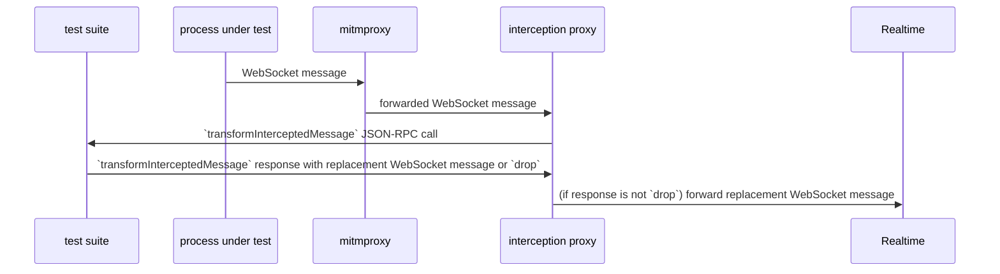

# Interception proxy API

## Overview

Here’s a sequence diagram showing what happens in the interception of a single WebSocket message from the client to Realtime:

The participants are the following:

- _test suite_: The process which is executing the tests.
- _process under test_: The process which is running the Ably client library.
- _mitmproxy_: A mitmproxy instance which, through some configuration, is intercepting all of the WebSocket connections initiated by the process under test, and which is running an addon that causes it to forward these connections to the interception proxy.
- _interception proxy_: A server (written by us) which has two responsibilities:
  - communication with the test suite
  - receiving WebSocket connections from mitmproxy and forwarding them to Realtime, allowing the test suite to modify the messages exchanged over these connections

As the diagram suggests, communication between the test suite and interception proxy happens through a JSON-RPC API. I’ll now document this API.

## JSON-RPC methods implemented in interception proxy

Implemented via text WebSocket messages exchanged between proxy and test suite. The WebSocket server is run by the proxy at `http://localhost:8001`.

### `startInterception`

The test suite calls this method on the proxy at the start of the test suite. It:

- results in an error if there is already an active test suite
- marks the WebSocket connection as belonging the active test suite (there is currently no way to undo this; to set a new active test suite you must restart the proxy)
- sets up a proxy for intercepting traffic (this may require cooperation from the tests; see `mode` below)

Request params is one of the following objects:

- `{ 'mode': 'local', 'pid': number }`: transparently intercept traffic from the process with the given PID (note that the PID is currently only used on macOS; in Linux we do interception by UID with the help of a bunch of `iptables` configuration, see `test-node.yml` workflow in https://github.com/ably/ably-js/pull/1816 for now)
- `{ 'mode': 'proxy' }`: run an HTTP proxy which listens on port 8080

Response result is an empty object.

### `transformInterceptedMessage`

The proxy calls this method on the active test suite each time a WebSocket message is intercepted. The test suite must return a result telling the proxy what to do with the message. Subsequent messages intercepted on that WebSocket connection, in the direction described by `fromClient`, will be queued pending the test suite’s reply.

Request params is an object with the following properties:

- `id`: a unique identifier for this message
- `connectionID`: a unique identifier for the intercepted WebSocket connection that this message belongs to
- `type`:
  - `binary` if the intercepted message is of Binary type
  - `text` if it is of Text type
- `data`: the data of the intercepted WebSocket message
  - if `type` is `binary`, then this value is Base64-encoded
- `fromClient`: boolean describing the direction in which the intercepted message was sent

Response result is one of the following objects:

- `{ "action": "drop" }`: this will cause the proxy to drop the intercepted message
- `{ "action": "replace", "type": "binary", "data": "(…)" }`: this will cause the proxy to replace the intercepted message with a message of Binary type whose data is the result of Base64-decoding the `data` property
- `{ "action": "replace", "type": "text", "data": "(…)" }`: this will cause the proxy to replace the intercepted message with a message of Text type whose data is the value of the `data` property

### `injectMessage`

The test suite calls `injectMessage` on the proxy. It immediately sends a message on a given direction on a given connection.

Request params is an object with the following properties:

- `type`, `data`, `fromClient` with same meaning as `transformInterceptedMessage` (i.e. describing the message to be injected)
- `connectionID` identifies the connection into which the message will be injected (for now, the only way to get this ID is from a previous `transformInterceptedMessage` call, but later I’ll probably add something that notifies the test suite when a connection is opened).

Response result is an object with the following properties:

- `id`: a unique identifier for the injected message
